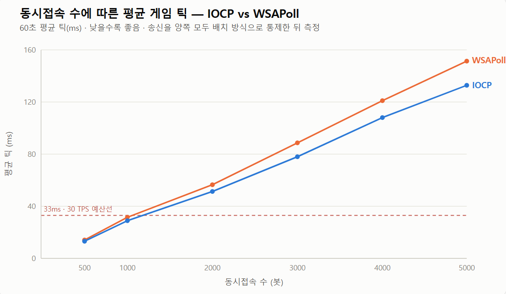
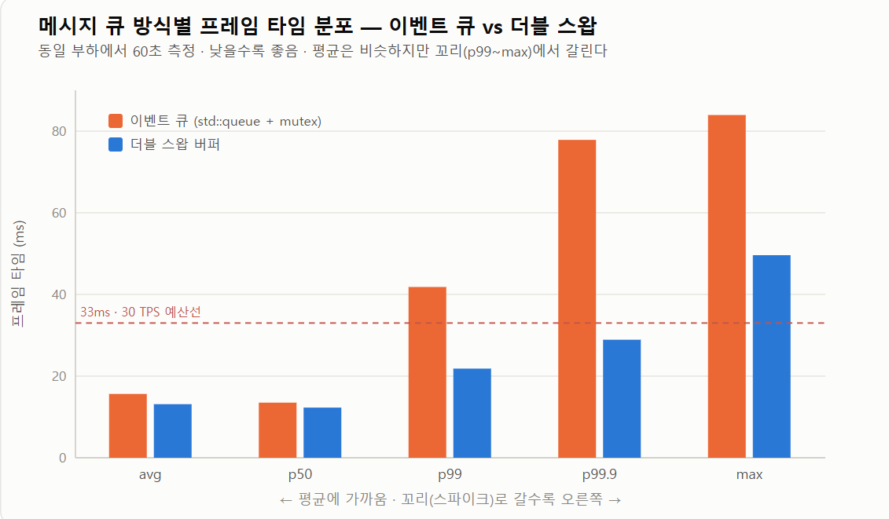

<h1 align="center">IOCP 기반 실시간 탑다운 슈팅 배틀로얄 게임 서버</h1>

  Windows <strong>IOCP</strong>로 구현한 C++ 멀티스레드 게임 서버 
  최대 방 갯수를 가변적으로 늘리고 줄일 수 있으며 
  하나의 방에 최대 100명이 동시 접속해 이동·사격하며 <strong>마지막 1인까지 생존</strong>하는 실시간 배틀로얄 게임입니다.

  
  

  
  &nbsp;&nbsp;&nbsp;
  

  <strong>▲ (좌) Go 언어 기반 그래픽 클라이언트 플레이 화면  </strong>   &nbsp;|&nbsp;   <strong>  (우) 서버 실시간 Tick/I/O 벤치마크 모니터링 콘솔 ▲</strong>

---

> 게임 콘텐츠 구현보다 고성능 네트워크 라이브러리와 서버 코어 구조 설계에 집중한 프로젝트입니다. 
> 실제 게임 서버에서 중요한 3가지 핵심 구조를 각각 두 가지 방식으로 구현하고, 동일한 환경에서 성능과 특성을 비교·분석했습니다.
> 
| **실험 주제**      | **비교 대상**        | **목적**               |
| -------------- | ---------------- | -------------------- |
| **I/O 모델**     | IOCP ↔ WSAPoll   | 대규모 동시 접속 소켓 처리 방식 비교   |
| **스레드 간 전달 큐** | 이벤트 큐 ↔ 더블 스왑 버퍼 | 멀티스레드 메시지 전달 구조 비교   |
| **수신 버퍼 구조**   | 링 버퍼 ↔ 가변 버퍼     | 패킷 수신 및 메모리 관리 방식 비교 |

---

## 아키텍처

패킷이 **수신 → 배치 송신**까지 흐르는 단일 파이프라인이고, 위 3가지 실험은 이 흐름의 서로 다른 지점에 위치합니다.

- **계층 분리** — 워커 스레드(= CPU 코어 수)는 수신·파싱만 담당하고, 게임 상태는 33ms(≈30Hz) 틱을 도는 **단일 로직 스레드가 단독 소유**합니다. 덕분에 플레이어·총알 상태에 락이 필요 없습니다.
- **서버 권위** — 클라이언트는 입력 키만 보내고 이동·충돌·시야 판정은 서버가 합니다. AOI는 공간 그리드로 **주변 이웃 셀만 계산**해 전송합니다.

---

## 실험 1 · I/O 모델 — IOCP vs WSAPoll

> "게임 서버는 IOCP로 짜야한다." 라는 통념에 따라 IOCP로 구현했지만, **그래서 폴링과 실제로 얼마나 차이가 나는거지?** 직접 재보기로 했습니다.
> WSAPoll 단일 스레드 서버를 따로 만들어 동일한 부하로 붙였습니다.

**① 1차 측정 — 예상과 정반대의 결과**

전 구간(500~5000)에서 오히려 **폴링이 IOCP보다 압도적으로 빨랐습니다.** "IOCP가 정답"이라는 통념과 반대라, 바로 결론을 내리는 대신 원인을 파고들었습니다.

**② 원인은 I/O 모델이 아니라 '송신 방식'이었다**

코드를 뜯어보니 폴링 서버는 틱 끝에 모아 보내는 **배치 송신**인데, IOCP 쪽은 **패킷마다 게임 로직 스레드에서 즉시 `WSASend`** 를 호출하고 있었습니다. 송신 비용이 로직 틱을 잡아먹어, 정작 비교하려던 변수(I/O 모델)가 아니라 **엉뚱한 변수(송신 방식)가 결과를 지배**하고 있었습니다.

**③ 변수를 통제하고 재측정**

양쪽 모두 **틱당 세션 1회 배치 송신**(`queueSend` → `FlushPending`)으로 통일한 뒤 다시 쟀습니다. 그러자 결과가 뒤집혀, **전 구간에서 IOCP가 앞섰고 부하가 커질수록 격차가 벌어졌습니다(6.8% → 12.3%)**.

  

| 동접(봇) | WSAPoll | IOCP | 격차 | 격차 % |
| --: | --: | --: | --: | --: |
| 500 | 14.09 | 13.14 | **+0.96** | 6.8% |
| 1000 | 31.53 | 28.92 | **+2.61** | 8.3% |
| 2000 | 56.53 | 51.33 | **+5.21** | 9.2% |
| 3000 | 88.66 | 77.99 | **+10.68** | 12.0% |
| 4000 | 121.02 | 108.07 | **+12.96** | 10.7% |
| 5000 | 151.41 | 132.81 | **+18.60** | 12.3% |

단위 ms · 동일 부하 60초 평균 틱

> ⚠️ 절대적인 틱 시간은 두 방식 모두 게임 로직 연산 부하로 인해 **33ms 예산을 초과**합니다. 이 실험이 말하는 건 "같은 로직을 얼마나 효율적으로 처리하느냐"이지 "몇 명을 수용하느냐"가 아닙니다.

**배운 점** — 벤치마크에서 진짜 어려운 건 측정 자체가 아니라 **비교하려는 변수만 남기고 나머지를 통제하는 것**이었습니다. 첫 결과가 통념과 반대로 나왔을 때 그대로 결론 내리지 않고 원인을 코드까지 추적한 것이 이 실험의 핵심입니다.

## 실험 2 · 스레드 간 전달 큐 — 이벤트 큐 vs 더블 스왑 버퍼

> 저는 평소 Go를 주로 쓰는데, 스레드 간 데이터 전달이 필요할 때 가장 먼저 떠오른 건 Go의 채널이었습니다. 채널은 내부에 뮤텍스를 품은 이벤트 큐라, 이 프로젝트에서도 `std::queue` + `std::mutex`로 같은 구조를 만들어 **워커 스레드(IOCP) → 게임 스레드**로 패킷을 넘겼습니다.

**① 증상 — 봇 N마리 동시 접속 시 프레임 스파이크**

평균 틱에서는 문제가 없었습니다. 문제는 테스트 봇 N마리를 **동시에 접속시킨 순간**이었습니다. 봇들이 한꺼번에 패킷을 쏟아내자 특정 틱에서 큰 스파이크가 생겼습니다.

**② 원인 — 메시지당 락 경합**

소비자인 게임 스레드는 `while(Pop())`으로 **메시지 하나당 락을 한 번씩** 잡는데, 그동안 워커 스레드들도 계속 `Push`하며 **같은 뮤텍스 하나를 두고 경합**하고 있었습니다. 부하가 커질수록 락 경합도 늘어나는 구조였습니다.

**③ 해결 — 더블 스왑 버퍼**

"어쩔 수 없다"로 넘기려다, 락을 최소화할 방법을 찾던 중 더블 스왑 버퍼를 알게 됐습니다. 게임 스레드는 **프레임당 `Swap()` 한 번**으로 back 버퍼를 통째로 가져오고, 처리는 **락 없이** 합니다. 스왑은 포인터만 교체하는 **O(1)** 이라, 락 유지 시간도 배치 크기와 무관하게 일정합니다.

  

| 지표 | 이벤트 큐 | 더블 스왑 | 개선 |
| :-- | --: | --: | :-- |
| avg | 15.64 | 13.14 | – |
| p50 | 13.49 | 12.28 | – |
| **p99** | 41.83 | 21.83 | 예산 초과 → **이하** |
| **p99.9** | 77.84 | 28.91 | 예산 초과 → **이하** |
| **max** | 83.93 | 49.62 | **−41%** |

단위 ms · 동일 부하 60초 측정

소비자 쪽 락 획득이 **메시지당 → 프레임당**으로 줄면서, **피크 프레임 타임(max)이 83.9ms → 49.6ms**, **p99가 41.8ms → 21.8ms**로 절반 가까이 떨어졌습니다. 무엇보다 이벤트 큐에서 **33ms 예산을 넘던 p99·p99.9가 더블 스왑에서는 예산 안으로 들어왔습니다.**

**배운 점** — **초기에는 평균 틱 타임만 측정했으나, 평균(15.6ms → 13.1ms)은 심각한 스파이크를 숨기고 있었습니다.** 33ms(30Hz) 예산을 초과하여 순간적인 렉을 유발하는 진짜 원인은 꼬리 지표(p99)에 숨어있었고, 이를 추적하면서 **실시간 게임 서버에서는 '평균'이 아닌 'p99' 관점으로 측정하고 최적화해야 한다는 사실**을 알게되었습니다.
